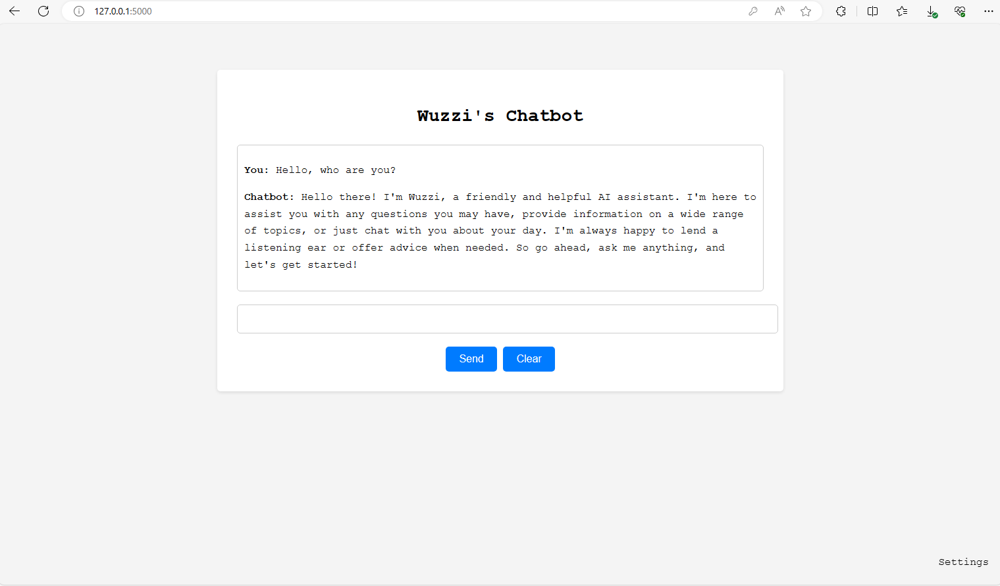

## wuzzi-chat

This is a simple Chat UI that can talk to `groq` and `openai` chat completion APIs.

The main purpose is to demonstrate and test red team tools for chat bots and LLM applications.



## OpenAI and groq API keys

wuzzi-chat supports `OpenAI` and `groq` chat completion endpoints. 

You need API keys, that you can get from:

1. **OpenAI:**  https://platform.openai.com 
2. **groq:**    https://console.groq.com/ 

Then set the API keys in your terminal, e.g.:

```bash
export OPENAI_API_KEY=<your_api_key>
export GROQ_API_KEY=<your_api_key>
```

You don't need both, just the one you would like to use with the application.

## Running the web server

Install the required dependencies and then run the web server:

```python
python chat.py
```

It will listen on http://127.0.0.1:5000 by default.


### Configuration settings in .env file

If you do not have a `.env` file the server will create one for you upon startup and ask for required values:

`CHATUI_API_KEY`: The token the client application has to send to communicate with wuzzi-chat. 
`CHATUI_API_PROVIDER`: Which LLM service to use, e.g. groq or OpenAI. the API key for those should already have been set

This is how a typical `.env` file will look like:

```
CHATUI_API_KEY=ThisIsMyTestKey1234
CHATUI_API_PROVIDER=groq
```

## Client Configuration

When you use the Chat app you need to the set the UI key and model in the browser, otherwise you'll see a *UNAUTHORIZED* message.
Go and click "SETTINGS" on the bottom right of the Chat UI to set the required values.

That's all.
